##### 第一课：课程

* 课程内容

1. web design

2. html

3. css

4. responsive design

   

* 静态网页：static website：只有前端，没有后端。


* 动态网站：Dynamic website：有后端支持，页面内容由后端动态生成。


* HTML像名词
* CSS像形容词
* JS像动词

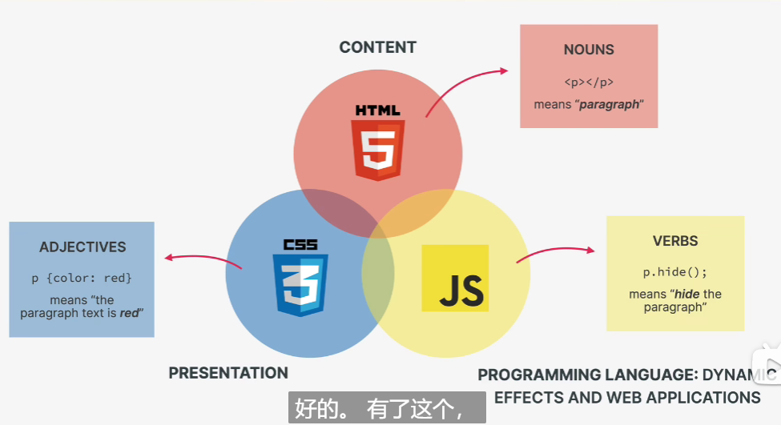

##### 第二课：安装VSCODE

* 安装prettier插件：


插件作用：每当你保存的时候，会自动格式化你的代码。

* 进入setting，设置默认formatter为prettier：


* 设置formart on save属性：保存时自动格式化：

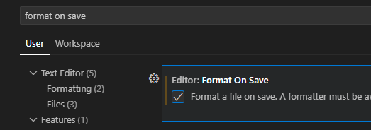

* 自动保存：离开窗口时自动保存文件：

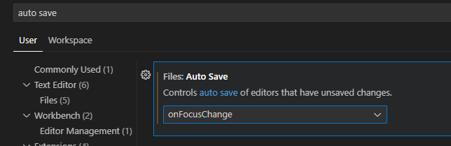


* tab size设置为2：

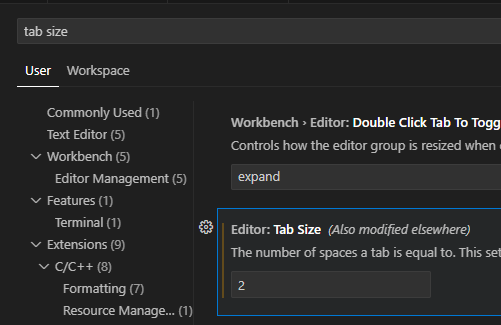


* 安装颜色主题插件：

  

* 设置主题：


* 安装Image preview：html图片预览


* 安装color highlight：高亮CSS颜色，可视化

  


* 安装Auto Rename Tag:同时修改<xx>和</xx>


* 安装live server：本地启动网页，支持html修改后，自动更新网页


* alt+B 在浏览器中打开网页

  

##### 第三课：写第一个网页

使用！+回车：生成模板

```html
<!DOCTYPE html>
<html lang="en">
  <head>
    <meta charset="UTF-8" />
    <meta name="viewport" content="width=device-width, initial-scale=1.0" />
    <title>My first webpage</title>
  </head>
  <body>
    <h1>Hello, world!</h1>
    <p>My name is Jojo, and this is my very first webpage :D</p>
  </body>
</html>
```


##### 第四课：HTML元素


* 标签


* 基本结构

  * 声明

  * html标签

  * head标签

  * body标签

  ```html
  <!DOCTYPE html>
  <html>
    <head>
      <title>The Basic Language of the web: HTML</title>
    </head>
  
    <body>
      <h1>The Basic Language of the web: HTML</h1>
    </body>
  </html>
  
  ```

  

* p标签

  p标签代表段落，一个段落的话放进p标签里。

  

* h1标签

  最佳实践：一个网页里最好只有一个h1标签。

  

* b加粗

  ```html
   <b>Laura Jones</b>
  ```

  最佳实践：别用b，用strong代替，b没有什么含义。

  ```html
  <strong>Laura Jones</strong>
  ```

  

* i斜体

  ```html
  <i>fundamental</i>
  ```

  最佳实践：别用i，用em代替，i没有什么含义。

  ```html
  <em>fundamental</em>
  ```

  

* ol-li有序列表

  ``` html
  <ol>
  	<li></li>
  </ol>
  ```


* ul-li无序列表

  ```html
  <ul>
  	<li></li>
  </ul>
  ```


* img图片

  ```html
  
  ```
  
  最佳实践：必须写alt，方便搜索引擎确认图片内容。方便盲人使用网站。


* html标签加入语言

  ```html
  <html lang="en">
  ```


* head里加入meta指定字符集

  ```html
  <head>
  	<meta charset="UTF-8"/>
  	<title>title</title>
  </head>
  ```


* a：链接有两种，又称为锚点

  1.站内的网页

  2.站外网页

  ```html
  <a href="https://developer.mozilla.org/zh-CN/docs/Web" target="_blank"
    >MDN Web Docs </a
  ```

  _blank决定是否会打开新的页面跳转。

  ```html
  <a href="#">test</a>
  ```

  #是一个占位符，该链接不指向任何。

  

* 面向开发者的web网站：

  [面向开发者的 Web 技术 | MDN](https://developer.mozilla.org/zh-CN/docs/Web)


* 导航栏盒子nav

  标识网站导航栏的盒子：

  ```html
  <nav>
  	<a href="blog.html">Blog</a>
  	<a href="#">Challengs</a>
  	<a href="#">Flexbox</a>
  	<a href="#">CSS Grid</a>
  </nav>
  ```

  

* 网站头部header

  标识网站的头部或者正文的头部的盒子

  ```html
  <header>
    <h1>📘 The Code Magazine</h1>
    <nav>
      <a href="blog.html">Blog</a>
      <a href="#">Challengs</a>
      <a href="#">Flexbox</a>
      <a href="#">CSS Grid</a>
    </nav>
  </header>
  ```


* 网站正文article

  标识网站的正文的盒子

  ```html
  <article>
  <h2>Basic Language of the Web: HTML</h2>
      
      ...
  </article>
  ```

  

* 网站的末尾footer

  标识网站的末尾的盒子

  ```html
  <footer>Copyright &copy; 2027 by The Code Magazine.</footer>	
  ```


* 网站的附属信息aside

  标识网站的次要内容

  ```html
  <aside></aside>
  ```

  

* 语义semantic HTML

  nav，header，footer，p本质都是div，只是为了表达语义而存在的。

  事实上，可以用div来替代所有其他的元素，配合CSS实现同样的效果。

  

  使用语义HTML的优点：

  * 搜索引擎优化

  * 方便使用文字阅读器的人

    

* 不错的网站：HTML特殊符号代码

[Glyphs | CSS-Tricks](https://css-tricks.com/snippets/html/glyphs/)


##### 第五课：CSS

* CSS描述了视觉风格。

  

* CSS规则


CSS有三种使用方法：

* 内联CSS：inline CSS

  ```html
  <h1 style="color: blue">📘 The Code Magazine</h1>
  ```

  不要使用这种CSS。


* 内部CSS：internal CSS

  ```html
  <html lang="en">
    <head>
      <meta charset="UTF-8" />
      <title>The Basic Language of the web: HTML</title>
      <style>
        h1 {
          color: blue;
        }
      </style>
    </head>
     ...
  ```

  放在head里的CSS


* 外部CSS：external CSS

  ```html
  <head>
      <meta charset="UTF-8" />
      <link href="style.css" rel="stylesheet" />
      <title>The Basic Language of the web: HTML</title>
  </head>
  ```

  在head里放css文件的链接


* 字体

  ```css
  h1 {
    color: blue;
    font-size: 26px;
    font-family: sans-serif;/* 字体 */
    text-transform: uppercase;/* 全大写 */
    font-style: italic;/* 斜体 */
    text-align: center;/* 在父元素内居中 */
    font-weight: bold;/* 加粗 */
  }
  ```

  

* 行高

  ```css
  p {
    font-size: 22px;
    font-family: sans-serif;
    line-height: 1.5; /* 行高1.5倍字体大小 */
  }
  ```

  

* 多元素集中设置:List selector

  ```css
  h1,
  h2,
  h3,
  h4,
  p,
  li {
    font-family: sans-serif;
  }
  ```

  

* 后代选择器：选择父元素为footer的p

  ```css
  footer p {
    font-size: 10px;
  }
  ```


* id选择器

  id是独一无二的，只允许一个元素拥有。尽量不使用id。

  HTML:

  ```html
  <p id="author">
    Posted by <strong>Laura Jones</strong> on Monday, June 21st 2027
  </p>
  ```

  CSS:

  ```css
  #author {
    font-size: 5px;
  }
  ```


* class选择器

  class可以有多个元素同时拥有。尽量使用class。

  ```css
  ul{
  	list-style:none;
  }
  ```

  ```html
  <ul class="related">
  </ul>
  ```

  

* 取消ul的黑点

  ```css
  ul{
  	list-style:none;
  }
  ```

  ```html
  <ul class="related">
  </ul>
  ```

  

* RGB模型

  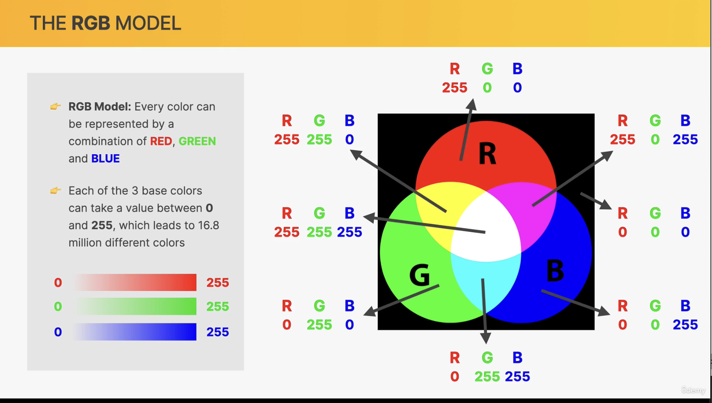


* rgb(0,0,0)
* rgba(0,0,0,0.3):0.3是透明度
* 十六进制：#00ffff，可以简写为#0ff
* 最佳实践：平时
* 使用十六进制，当需要透明度时，使用rgba


* 灰色：RGB三个值一样的颜色都是灰色

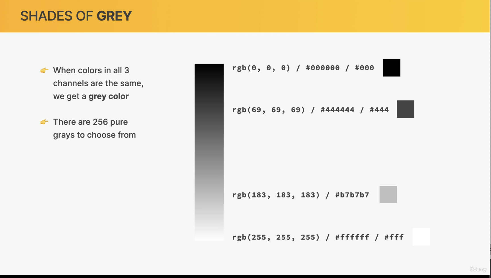


* border边框

  ```css
  
  aside {
    background-color: #f7f7f7;
    border-top: 5px solid #1098ad; /* 上边框 */
    border-bottom: 5px solid #1098ad; /* 下边框 */
    border: 5px solid #1098ad; /* 上下左右 四个方向边框 */
  }
  ```

  solid是连线，可以改成虚线dashed等别的样式


* 伪类：pseudo classes

  ```css
  /* li的第一个子元素 */
  li:first-child {
    font-weight: bold;
  }
  
  /* li的最后一个子元素 */
  li:last-child {
    font-style: italic;
  }
  
  /* li的奇数子元素 */
  li:nth-child(odd) {
    color: red;
  }
  
  /* li的偶数子元素 */
  li:nth-child(even) {
    color: blue;
  }
  
  /* li的第2个子元素 */
  li:nth-child(2) {
    color: red;
  }
  
  /* article的第一个子元素为p的话 */
  article p:first-child {
    color: red;
  }
  
  /* article的最后一个子元素为p的话 */
  article p:last-child {
    color: red;
  }
  ```

  

* a的伪类

  link,visited,hover,active必须都实现：
  
  ```css
  /* 含义href的a */
  a:link {
    color: #1098ad;
    /* 下划线去掉 */
    text-decoration: none;
  }
  
  /* href不等于#的a */
  a:visited {
    color: #777;
  }
  
  /* a在鼠标选择时的样式 */
  a:hover {
    color: red;
    font-weight: bold;
    /* 下划线样式，点线，橙色 */
    text-decoration: underline dotted orange;
  }
  
  /* a在鼠标点击时的样式 */
  a:active {
    background-color: black;
    font-style: italic;
  }
  ```


* 浏览器开发工具使用技巧

  查看选择的元素的样式：

  在3区域可以直接查看该元素的所有样式，也可以直接修改新增样式：

  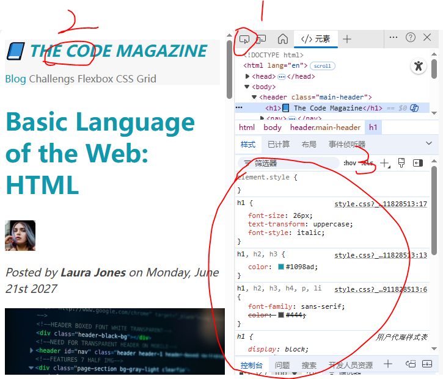

* 强制模拟元素状态

  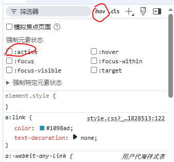

* 在对应元素上右键，点击检查可以直接跳转到该元素所在html源码

  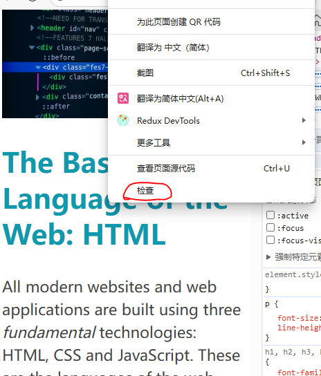


* 多个CSS选择器出现冲突：


* 多个选择器存在冲突的时：

* 5.最高优先级，!important，比较hack，最好别有，除非真搞不懂时，

* 4.内联css

* 3.id选择器

* 2.class选择器和伪类

* 1.最低优先级，*通用选择器

* 0.继承自父类

  同优先级同时存在是，最后一个选择器生效。

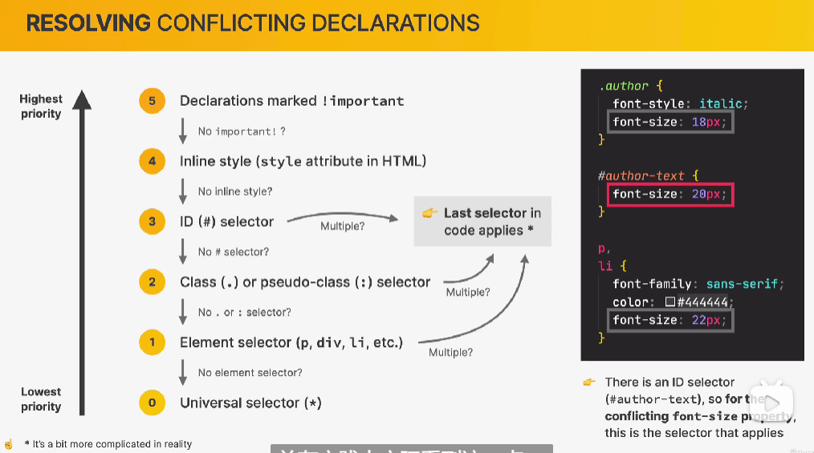


* 例子：

  ```html
  <footer>
    <p id="copyright" class="copyright text">
      Copyright &copy; 2027 by The Code Magazine.
    </p>
  </footer>
  ```

  ```css
  #copyright {
    color: red;
  }
  
  .copyright {
    color: blue;
  }
  
  .text {
    color: yellow;
  }
  
  footer p {
    color: green;
  }
  
  ```

* 最后生效的是id选择器：#copyright

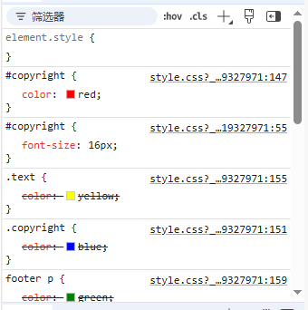


* 继承

* 文字类的属性会从父类继承

* strong元素继承父元素p特性：

  

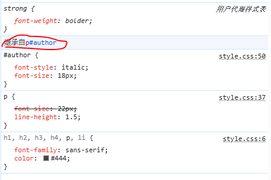

* body是所有元素的父元素

  ```css
  body {
    color: red;
  }
  ```


* 不是所有元素都支持继承

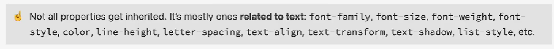


* 通用选择器 *所有元素都使用该属性，任何属性都可以实现，不支持继承的属性也可以实现。

```css
* {
  border-top: 5px solid #1098ad;
}
```


* CSS BOX MODEL 盒子模型
  * 内容：在盒子内部
  * Border：在盒子内部
  * Padding：在盒子内部
  * Margin：在盒子外部
  * Fill area：盒子内部所有区域，background color覆盖的区域

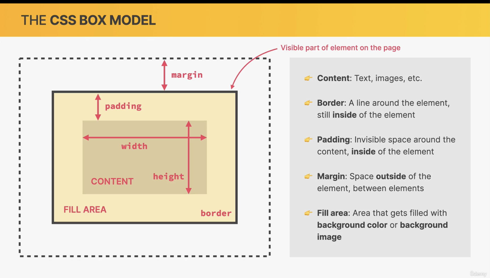


* 用现实生活来类比盒子模型

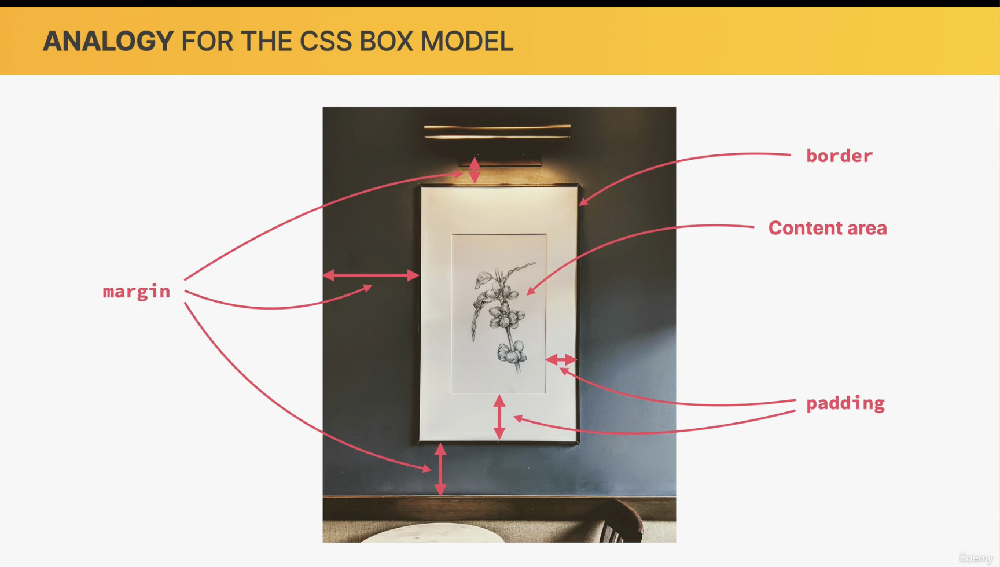


* 元素宽度=左border+左padding+width+右padding+右border

* 元素高度=上border+上padding+height+下padding+下border

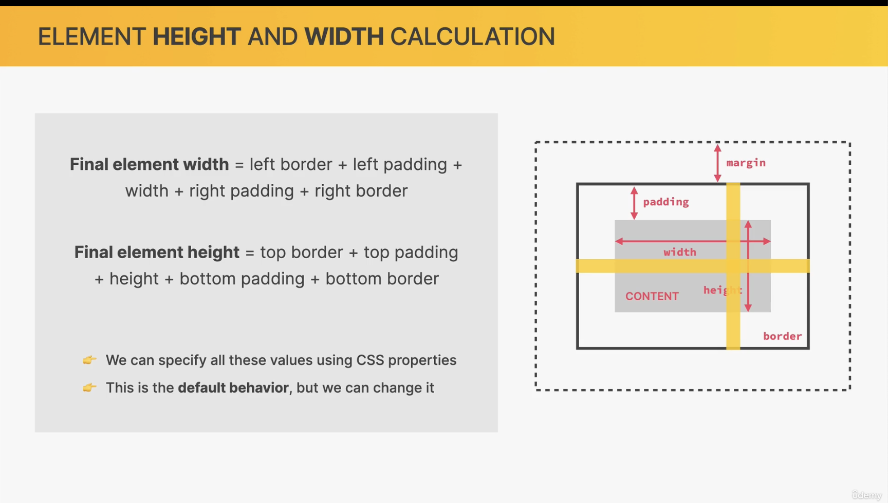


* padding

  ```css
  .main-header {
    background-color: #f7f7f7;
  
    padding: 20px;
    padding-left: 10px;
    padding-right: 10px;
    /* 上下20px 左右40px*/
    padding: 20px 40px;
    
  }
  ```

  

* 全局重置：每个元素默认有padding和margin，应该被全部清0

  ```ccs
  * {
    margin: 0;
    padding: 0;
  }
  ```


* 增加下部距离使用margin-bottom
* 增加内部空间使用padding
* 增加外部空间使用margin


* width和height

  百分比的width用于响应式设计，自动适应不同屏幕大小。

  ```css
  .post-img {
    width: 800px;
    /* 占父元素的宽度百分比*/
    width: 100%;
    /* 高度根据宽度自适应 */
    height: auto;
  }
  ```

  


* 将页面整个居中

  margin左右都为auto，会保持container居中。

  ```css
  .container {
    /* 保持宽度 */  
    width: 700px;
    /* margin-left: auto;
    margin-right: auto; */
    /* 上下0 左右auto*/
    margin: 0 auto;
  }
  ```

  ```html
  <body>
      <div class="container">
          ...
      </div>
  </body>
  ```


* box 类型分类
 * block：占据整行，左右可设置，例如：h,p,div,ul,ol,li
 * inline ：和内置的文本一样宽度，左右不可设置，例如: strong,a
 * inline block：和内置的文本或图片一样宽度，左右可以设置，例如：img


* block level 块级元素:

  占据100%父元素宽度

  默认是垂直排列的

  盒子模型正常工作

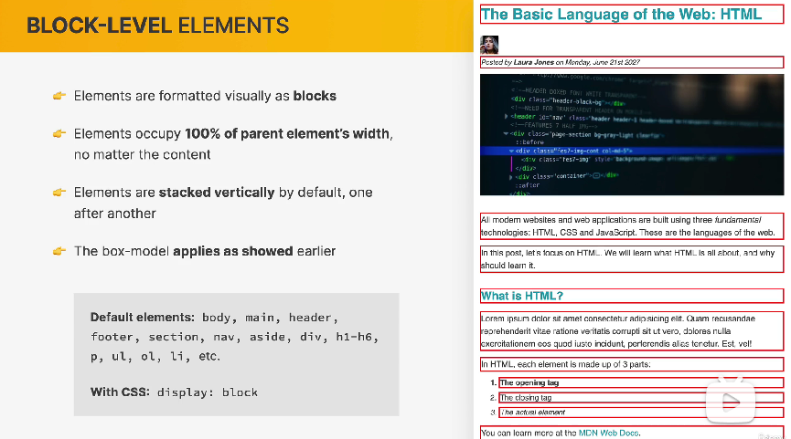

将元素改为block的方法：

```css
x{
	display:block
}
```


* inline 内联元素

  只占据其内容的空间

  横向排列

  height和width不起作用

  padding和margin只能用left和right

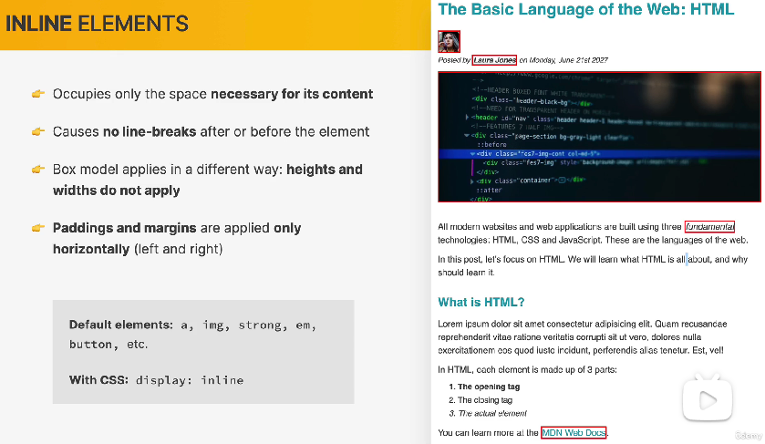

将元素改为inline的方法：

```css
x{
	display:inline
}
```


* inline-block 元素

  只占据其内容的空间

  横向排列

  盒子模型正常工作

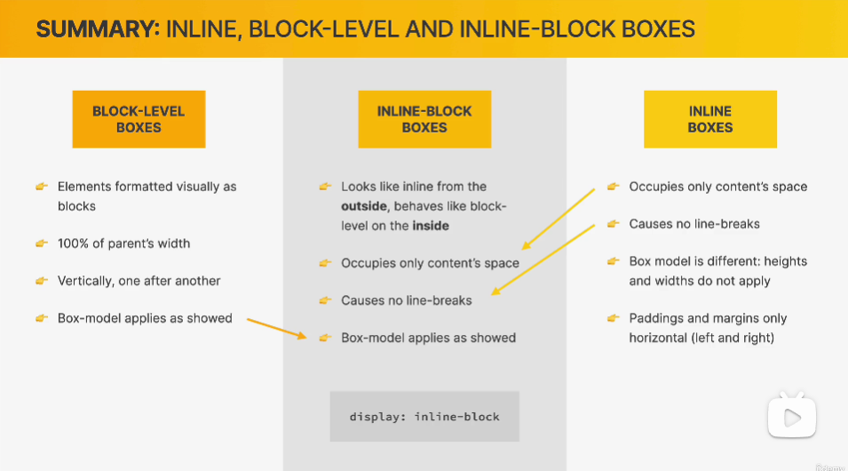

将元素改为inline-block的方法：

```css
x{
	display:inline-block
}
```

# 


* 使用emoji快捷键：win+.

😂😊🤣❤😍😒👌😘


* Normal Flow文档流

* absolute position绝对定位

  默认html排版是在文档流之中的。

  使用绝对定位会让元素脱离文档流

  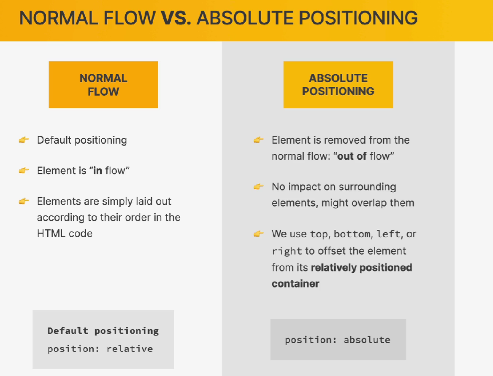

  

```css
/* 在父元素中必须标识relative，不然子元素会相对于视窗是做绝对定位*/
father{
	position: relative;
}

/* son 子元素相对于父元素的位置是top50，right50*/
son {
    top:50px;
    right:50px；
    /*left:50px;
    right:50px;*/
	position: absolue;
}
```

* Tips:最好不要大量使用绝对定位，这会使得页面变得复杂，只对单个或极少的元素使用。


* 伪元素:: Pseudo-element

伪元素::可以选择不存于html中的元素。

```css

/*h1的第一个字母*/
h1::first-letter {
  font-style: normal;
  margin-right: 5px;
}

/*h2的第一个字母*/
h2::first-letter {
  font-style: 60px;
  margin-right: 5px;
}

/*p的第一句话*/
p::first-line {
  /* color: red; */
}

/*h3之后的相邻兄弟元素p的第一句话*/
h3 + p::first-line {
  color: red;
}

h2 {
  background: orange;
  /*配合after定位*/
  position: relative;
}

/*after 其实是h2的子元素*/
h2::after {
  /* 指定内容 */
  content: "TOP";
  background-color: #ffe70e;
  font-size: 16px;
  font-weight: bold;
  /*after默认是inline，为了可以padding，改为inline-block*/
  display: inline-block;
  padding: 5px 10px;
  /*脱离文档流*/
  position: absolute;
  /* 负值 可以超出父元素的盒子 */
  top: -10px;
  right: -25px;
}
```


* 推荐网站 CSS-Tricks，stackoverflows，MDN，你不需要知道所有CSS知识，但要学会查找。


* 常见html问题：闭合问题:  <h3>没有</h3>

  

* 检查html错误的网站：

[	The W3C Markup Validation Service](https://validator.w3.org/#validate_by_input)


* diff checker网页diff对比文件的工具

​	[Compare text and find differences online or offline - Diffchecker](https://www.diffchecker.com/)


* 常见css问题：
  * 多个选择器选择了同一个元素，选择器冲突。通过浏览器检查属性debug。
  * 选择器属性拼写错误。通过浏览器检查属性debug。


* 一般选择器是比较复杂的会生效：

  ```css
  /* 这个会生效，但不要写太复杂（3个项）的选择器*/
  .main-header nav a:link {
  	margin-top: 100px;
  }
  
  nav a:link {
  	margin-top: 100px;
  }
  ```

  

* 浏览器dev 工具调整大小快捷键

  选择font-size：使用上下来调整字体大小，使用shift+上下：-+5来调整+5

  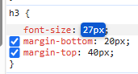

##### 第六课：LAYOUT布局

布局是前端的主要工作之一。

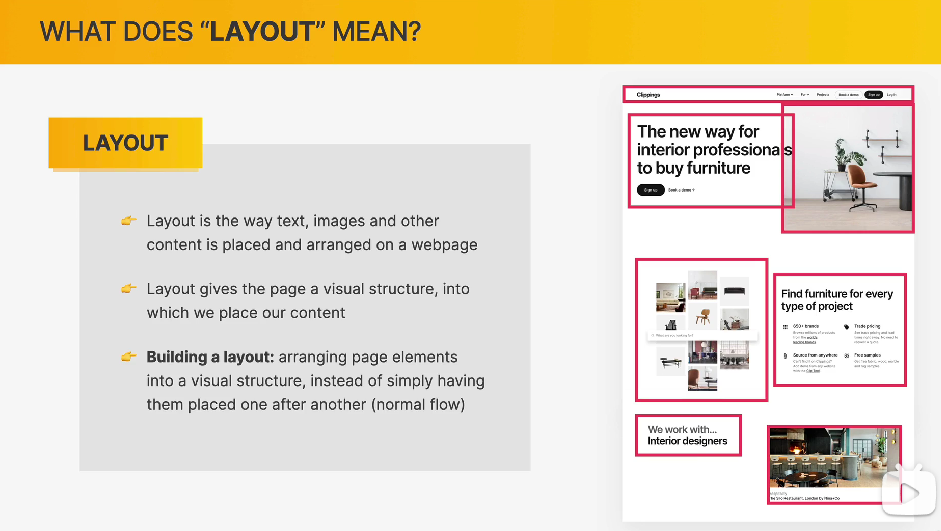


组件内也有布局：

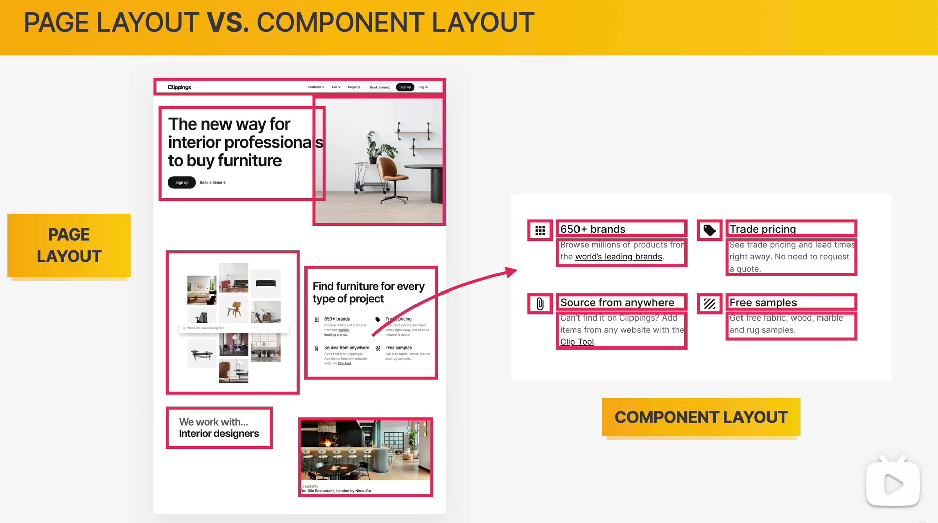


三种布局：

* Float布局：老式布局。
* FLexbox布局：1维布局，现代布局。
* Grid布局：2维布局，现代布局。

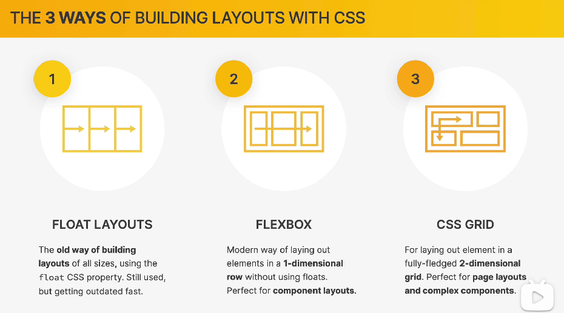


* Lorem：为了测试排版的随机文字：vscode中输入Lorem按回车生成。


* vscode技巧：alt+↑或者alt+↓，移动该行到上面一行或下面一行。


* Float布局

1.Float是一种脱离文档流的布局，

2.FLoat的元素依然会影响周围的未Float元素，周围的元素会围绕着float排列，周围的元素的padding无视float所在的位置。

3.子元素都Float了的话，父元素的高度会变成0。

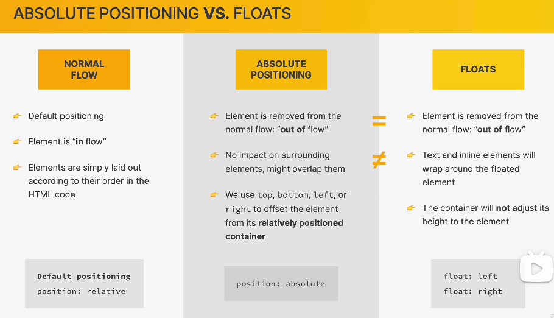

```css
.author-img {
  float: left;
  /*margin依然会把周围的元素推开*/
  margin-bottom: 30px;
}

.author {
  float: left;
  /*margin依然会把周围的元素推开*/
  margin-left: 20px;
  margin-top: 10px;
}

h1 {
  float: left;
}

nav {
  float: right;
}
```


* 解决父元素高度变零

  方法1.在float的元素下面插入一个空div，设置为clear属性：

  ```html
  <header class="main-header">
    <h1>📘 The Code Magazine</h1>
    <nav>
      <a href="blog.html">Blog</a>
      <a href="#">Challengs</a>
      <a href="#">Flexbox</a>
      <a href="#">CSS Grid</a>
    </nav>
  	/* 插入空div*/
    <div class="clear"></div>
  </header>
  ```

  ```css
  .clear {
    clear: both;
  }
  ```

  

方法2.在父元素class加入clearfix类

```html
<header class="main-header clearfix">
  <h1>📘 The Code Magazine</h1>
  <nav>
    <a href="blog.html">Blog</a>
    <a href="#">Challengs</a>
    <a href="#">Flexbox</a>
    <a href="#">CSS Grid</a>
  </nav>
</header>
```

```css
/* 添加子元素 */
.clearfix::after {
  clear: both;
  content: "";
  display: block;
}
```


* 实例：

  article与aside并排，footer在他们后面

  ```html
  <div class="father">
  <article>
  </article>
  <aside>
  </aside>
  <footer>
  </footer>
  </div>
  ```

  

  ```css
  .father {
    width: 1200px
  }
  article {
    float: left;
    width: 825px;
  }
  
  aside {
    float: right;
    width: 300px;
  }
  
  footer {
    clear: both;
  }
  ```

  


* Box-sizing:一个属性重新定义宽和高的范围，


加入全局设置，方便所有元素计算宽高。

```css
* {
  margin: 0;
  padding: 0;
  box-sizing: border-box;
}
```


* Flexbox

  和float不一样，不需要大量计算微调，浏览器自动计算宽度。

```css
  .container {
    /* STARTER */
    font-family: sans-serif;
    background-color: #ddd;
    font-size: 32px;
    margin: 40px;

    /* FLEXBOX */
    display: flex;
    /*副轴居中*/
    align-items: center;
    /*副轴居顶*/
    /* align-items: flex-start; */
    /*副轴居底*/
    /* align-items: flex-end; */
    /*副轴拉伸 所有元素和最高的子元素一样高*/
    /* align-items: stretch; */

    /*主轴方向居中*/
    justify-content: center;
    /* 主轴方向平铺 */
    /* justify-content: space-between; */
  }
```


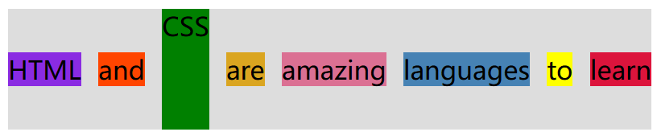


* 什么是Flexbox

  1.是CSS一维布局

  2.自动分配子元素的空白区域

  3.方便横着排版

  4.解决垂直居中和子元素等高的问题。

  5.完美替代float，使用更少和干净的代码。

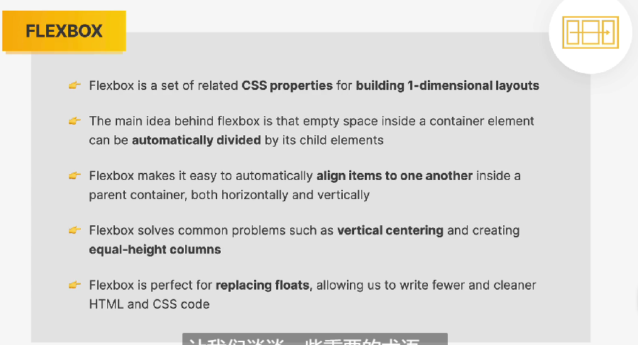


* Flexbox的父元素叫作Flex Container，它的直接子元素叫作Flex Items
* Flexbox的子元素按照主轴（main axis）方向排列。
* 另一个方向称为横轴（cross axis）

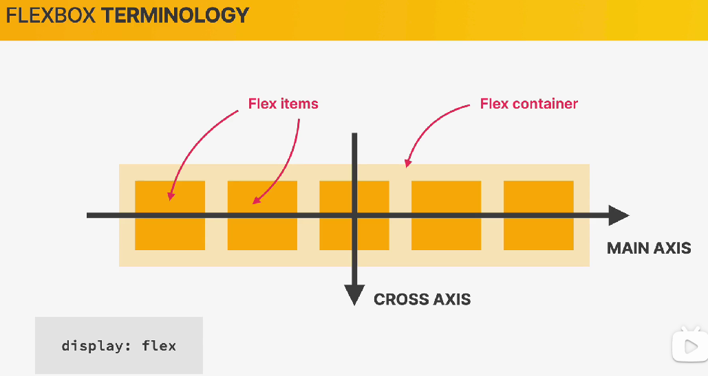


在父元素中加入flex,开启flex布局。

```css
father{
	display:flex
}
```


* Flexbox常用属性

  * Flex Container：

    1.gap: 创建item之间的空间，不依赖margin

    2.jusifty-content: 设置主轴对齐方式

    3.align-item：设置副轴对齐方式

    4.flex-direction：设置主轴是横向还是竖向

    5.flex-wrap：高级用法，这节课不讲

    6.aligin-content：高级用法，这节课不讲

  

  * Flex Item：

    1.align-self：覆盖Flex Contaner的align-item

    2.flex-grow：拉伸原则：0禁用，1使能，2更宽...

    3.flex-shrink：压缩原则：0禁用，1使能，2压缩更多...

    4.flex-bassis：确定宽度，取代width，flex布局应该使用该参数来定义宽度

    5.flex： 0 1 auto; 是2,3,4的组合语法，取代2,3,4是最佳实践。

    6.order：决定排列顺序，默认值0，比0小优先级会更高，比0大优先级更低。
  
    

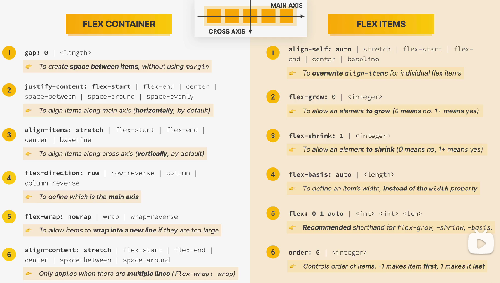


* 例子：

  ```css
    .container {
      /* STARTER */
      font-family: sans-serif;
      background-color: #ddd;
      font-size: 32px;
      margin: 40px;
  
      /* FLEXBOX */
      display: flex;
      /*副轴居中*/
      align-items: center;
      /*主轴方向居顶*/
      justify-content: flex-start;
      /*子元素的间距*/
      gap: 20px;
    }
  
    .el--1 {
      /*该子元素顶部对齐*/
      align-self: flex-start;
    }
  
    .el--2 {
      /*该子元素底部对齐*/
      align-self: flex-end;
    }
  
    .el--5 {
      /*该子元素拉伸对齐*/
      align-self: stretch;
      /*该子元素排列优先级*/
      order: 2;
    }
  
    .el--6 {
      /*该子元素排列优先级*/
      order: -1;
    }
  ```

  


* flex属性的例子：

  ```css
     .container {
      /* STARTER */
      font-family: sans-serif;
      background-color: #ddd;
      font-size: 32px;
      margin: 40px;
  
      /* FLEXBOX */
      display: flex;
      /*副轴居中*/
      align-items: center;
         
      /*主轴方向居顶*/
      justify-content: flex-start;
      /*子元素的间距*/
      /* gap: 20px; */
    }
  
    .el {
      /*
      默认值
      flex-grow: 0;
      flex-shrink: 1;
      flex-basis: auto;
      */
      flex-shrink: 0;
      flex-grow: 1;
      /* flex-basis: auto; */
      /* 最佳实践flex取代shrink，grow和basis */
      flex: 1 0 auto;
      /* flex: 0 0 200px; */
    }
  
    .el--1 {
      /*该子元素顶部对齐*/
      align-self: flex-start;
      flex-grow: 2;
    }
  
    .el--2 {
      /*该子元素底部对齐*/
      align-self: flex-end;
    }
  
    .el--5 {
      /*该子元素拉伸对齐*/
      align-self: stretch;
      /*该子元素排列优先级*/
      /* order: 2; */
    }
  
    .el--6 {
      /*该子元素排列优先级*/
      /* order: -1; */
    }
  ```

  

* **当你希望两个元素使用flex布局时，如果它们==没有共同父元素==，第一步是创建新的div作为它们的父元素来帮助布局**

  

* flex-basis: auto表示弹性元素在主轴方向上的初始大小由其内容决定，未指定宽度时默认使用内容宽度

* flex-basis: 0%表示在Flex布局中，元素在主轴方向上的初始尺寸为0，但会参与剩余空间的分配比例计算。

  

* flex的简写

```css
/*flex取auto*/
.item {
	flex: auto
}
/*等同于*/
.item {
	flex-grow: 1;
	flex-shrink: 1;
	flex-basis: auto
}

/*flex取none*/
.item {
	flex: none
}
/*等同于*/
.item {
	flex-grow: 0;
	flex-shrink: 0;
	flex-basis: auto
}

/*flex取一个非负数字，则该值为flex-grow的值*/
.item {
	flex: 1
}
/*等同于*/
.item {
	flex-grow: 1;
	flex-shrink: 1; 
    /*[flex-basis: 0%]表示在Flex布局中，元素在主轴方向上的初始尺寸为0，但会参与剩余空间的分配比例计算。*/
	flex-basis: 0%
}

/*flex取一个非负数字，flex-shrink默认取1，flex-basis默认取0%*/
/*flex取两个非负数字，则分别视为 flex-grow和flex-shrink的值，flex-basis取0%*/
.item {
	flex: 1 2
}
/*等同于*/
.item {
	flex-grow: 1;
	flex-shrink: 2;
	flex-basis: 0%
}

/*flex取一个非负数字和长度或百分比，则视为flex-grow和flex-basis的值。flex-shrink取1*/
.item {
	flex: 200 20%
}
/*等同于*/
.item {
	flex-grow: 200;
	flex-shrink: 1;
	flex-basis: 20%
}

/*flex取一个长度或者百分比，则视为flex-basis的值。flex-grow和flex-shrink分别取1*/
.item {
	flex: 20%
}
/*等同于*/
.item {
	flex-grow: 1;
	flex-shrink: 1;
	flex-basis: 20%
}

/*flex取一个长度或者百分比，则视为flex-basis的值。flex-grow和flex-shrink分别取1*/
.item {
	flex: 20px
}
/*等同于*/
.item {
	flex-grow: 1;
	flex-shrink: 1;
	flex-basis: 20px
}
```


* 技巧：查看flex布局的按钮：

  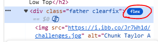

  界面保持显示flex边距：

  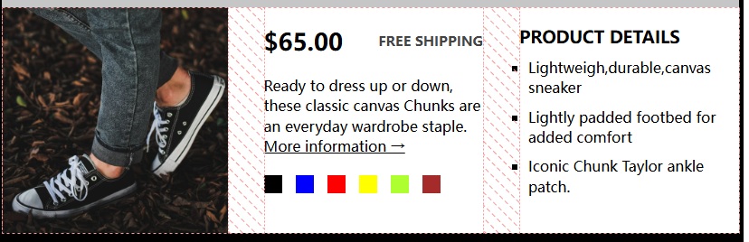


* Grid布局

  代码：

  ```css
    .container--1 {
      /* 布局类型 */
      display: grid;
      /* 列宽 */
      grid-template-columns: 200px 200px 100px 100px;
      /* 行宽 */
      grid-template-rows: 300px 200px;
      /* 在grid中，margin无效，只能使用gap*/
      /* 间隙 */
      /* gap: 30px; */
      /* 列间隙 */
      column-gap: 30px;
      /* 行间隙 */
      row-gap: 60px;
    }
  ```


* 什么是CSS Grid

  1.用于2维布局

  2.中心思想是将布局分为行和列

  3.使用更少的html和更易阅读css

  4.不是为了替代flexbox，1维用flexbox，2维用grid

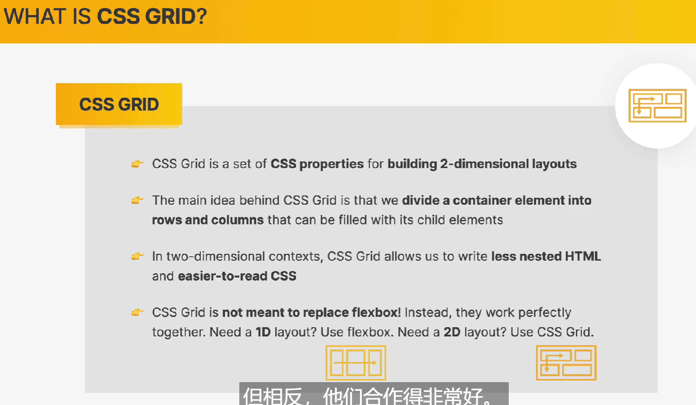


* Grid的父元素叫作Flex Container，它的直接子元素叫作Gird Items
* Grid的横轴（row axis）
* Grid的竖轴（column axis）

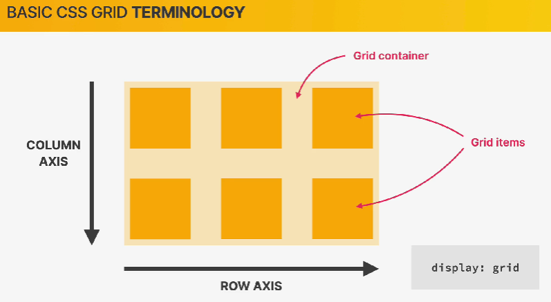


* Grid lines：Grid分割线，从1开始
* Grid track/row：行
* Grid track/row：列
* Gutters(gaps): 间隙
* Grid Cell：格子，无论是否被子元素占据都叫格子

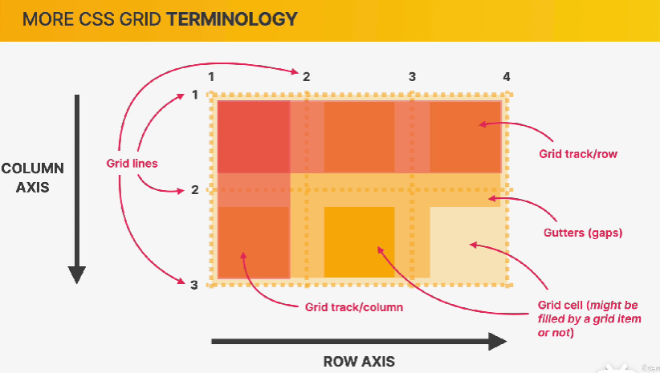


* Grid常用属性

  * Grid Container：

    1. grid-template-rows: 每行的宽度

    2. grid-template-columns: 每列的宽度

    3. row-gap：行间隙

    4. column-gap：列间隙

    5. gap：间隙

    6. justify-items：item的水平对齐方式

    7. align-items：item的垂直对齐方式

    8. ~~justify-contents：不常用，水平对齐方式，整个grid比它的Grid Container容器更小时使用~~

    9. ~~align-contents：不常用，垂直对齐方式，整个grid比它的Grid Container容器更小时使用~~

  * Flex Item：

    1. grid-column：设置该item放在哪个位置，从line几到line几

    2. flex-grow：设置该item放在哪个位置，从line几到line几

    3. justify-self：覆盖父元素的justify-items

    4. align-self：覆盖父元素的align-items

       

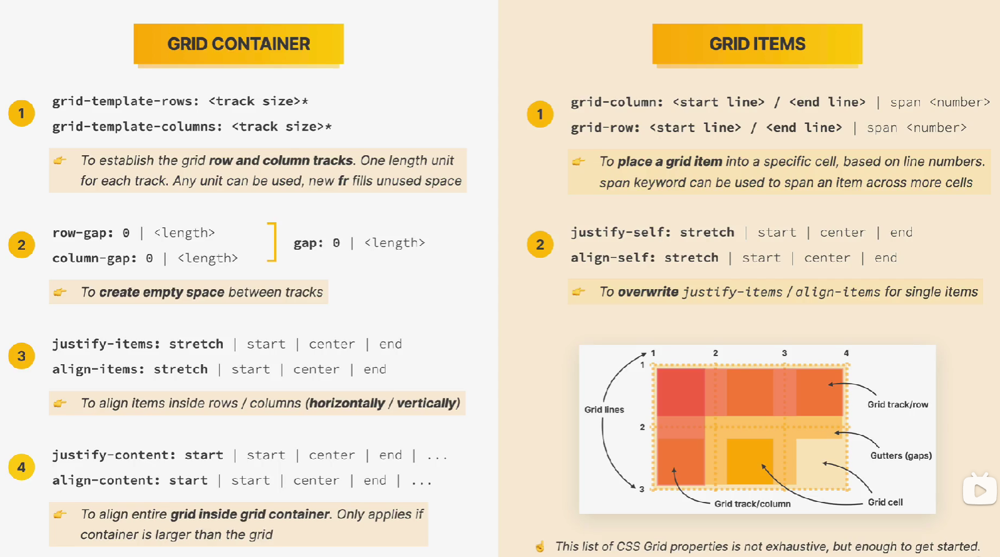


* fr，repeat用例：

```css
father {
    /* 指明grid布局 */
    display: grid;

    /* fr是指占多少份 */
    /* grid-template-columns: 2fr 1fr 1fr 1fr; */
    
    /* auto和元素内容大小一致 */
    /* grid-template-columns: 2fr 1fr 1fr auto; */
    
	/* 使用px固定宽度*/
    /* grid-template-rows: 300px 200px; */
    
    /* 使用repeat来重复1fr 重复4次 */
    grid-template-columns: repeat(4, 1fr);
    grid-template-rows: 1fr 1fr;
    height: 500px;
}
```


* 技巧：查看grid布局的按钮：

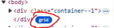

界面保持显示grid边距和分割线序号：

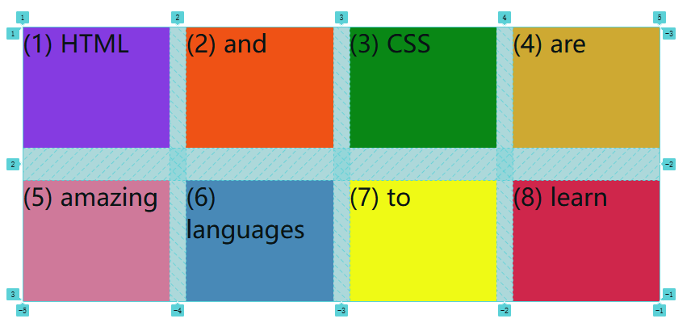

* grid-colum，grid-row，span，用例：

  ```css
  .el--8 {
      /* 起始line：3 结束line：4 */
      /* grid-column: 3/4 可以省略为grid-column: 3 */
      grid-column: 3/4;
      grid-row: 1/2;
  }
  
  .el--2 {
      /* grid-column: 1/4等于grid-column: 1/span 3;*/
      /* grid-column: 1/4; */
  
      /* grid-column: 1/span 3； */
      /* -1代表最后一行*/
      /* -2代表倒数第二行*/
      grid-column: 1/-1;
      grid-row: 2/3;
  }
  ```


* container/cell对齐方式，用例：

  ```css
    .container--2 {
      /* STARTER */
      font-family: sans-serif;
      background-color: black;
      font-size: 40px;
      margin: 40px;
  
      width: 700px;
      height: 600px;
  
      /* CSS GRID */
      display: grid;
      grid-template-columns: 125px 200px 125px;
      grid-template-rows: 250px 100px;
      gap: 20px;
  
      /* 整个grid对齐方式/
      /*整个grid在该container--2 容器中水平居中*/
      justify-content: center;
      /*整个grid在该container--2 容器中水平分散排列*/
      /* justify-content: space-between; */
  
      /*整个grid在该container--2 容器中垂直居中*/
      align-content: center;
  
      /*整个grid在该container--2 容器中顶部对齐*/
      /* align-content: start; */
  
      /*整个grid在该container--2 容器中底部对齐*/
      /* align-content: end; */
  
      /*整个grid在该container--2 容器中水平分散排列*/
      /* align-content: space-between; */
  
      /* 每个cell内部的对齐方式 */
      /*内部水平顶部对齐*/
      align-items: start;
      /*内部水平底部对齐*/
      align-items: end;
      /*内部水平居中对齐*/
      align-items: center;
      /*内部垂直居中对齐*/
      justify-items: center;
    }
  
    /*cell子元素内部实现对齐*/
    .el--3 {
      /*内部水平居中对齐*/
      align-self: center;
      /*内部垂直底部对齐*/
      justify-self: end;
    }
  ```
  


* blog用例：

```css

.container {
  display: grid;
  grid-template-columns: 1fr 300px;
  column-gap: 75px;
  row-gap: 60px;
}

.main-header {
  grid-column: 1/-1;
  grid-row: 1/2;
  margin-bottom: 0px;
}

article {
  grid-column: 1/2;
  grid-row: 2/3;
}

aside {
  grid-column: 2/3;
  grid-row: 2/3;
  align-self: start;
}
footer {
  grid-column: 1/-1;
  grid-row: 3/4;
}
```


第七课：网页设计

* 既会开发又会设计网页的开发人员是比较少的。
* 网页设计者创建网页的外观和风格。
* 网页开发者将网页设计者的文稿转化为实际的网页。


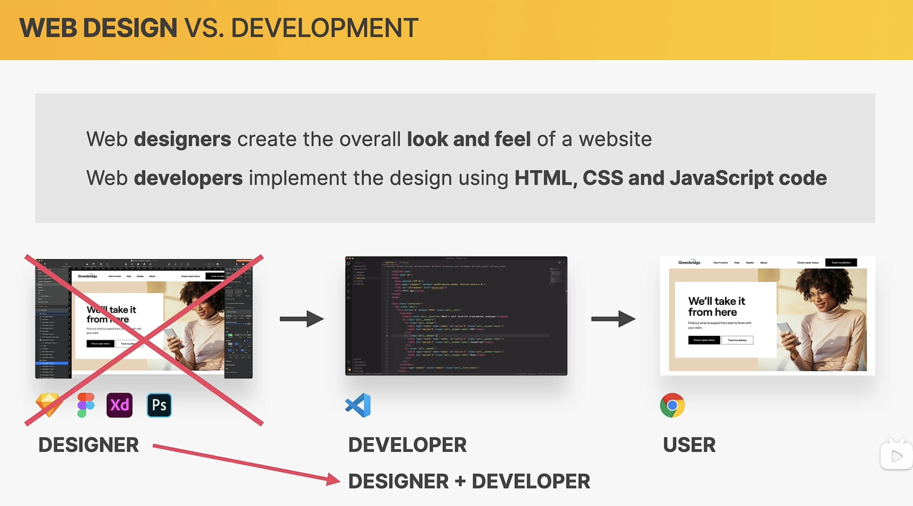


* 好的网页设计：

  * 为品牌留下好的印象

  * 让客户信任品牌

  * 增加客户对产品的感知价值

  * 给到客户准确的信息，方便客户完成既定任务，如购物等
* 不好的网页设计：
  * 让客户决定品牌不在意产品和服务
  * 让客户担心信任品牌
  * 让品牌看起来很low
  * 让客户困惑，难以实现他们的既定任务，如购物等

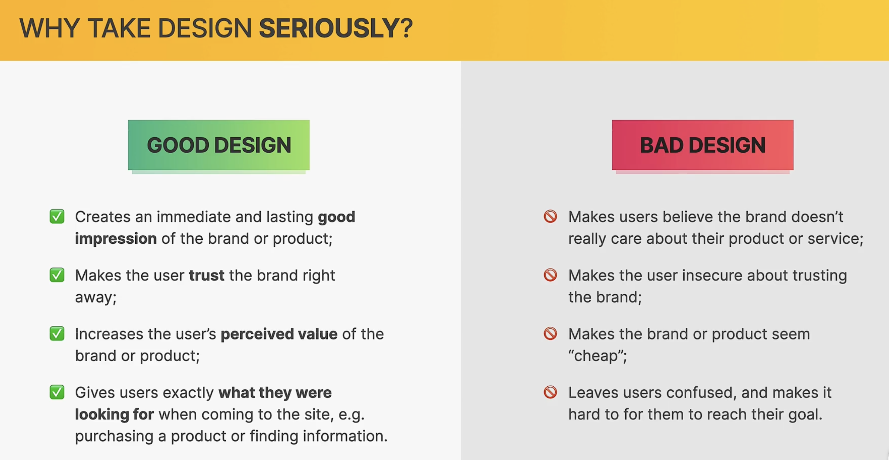


* 任何人都可以学会网页设计

  * 好的网页设计不是主观或有创造力的

  * 所有人都可以通过遵循一些规则或者框架来学习基础
  * 我通过分析上百个网站，解析出一套规则，将他们分为9个部分，通过这套规则+加上网站的个性构造新的网站。

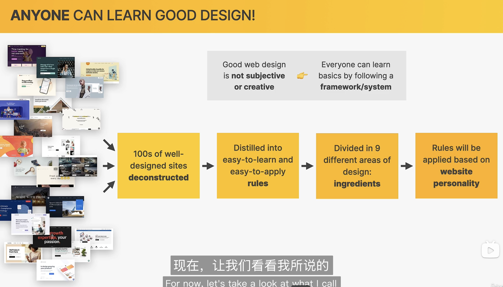


* 规则的9大部分

  1. 文字的大小，字体，间距，字体排版学。

  2. 颜色

  3. 图片

  4. 图标

  5. 阴影

  6. 边框圆角

  7. 留白

  8. 视觉层次

  9. 用户体验

  10. 组件/布局

      

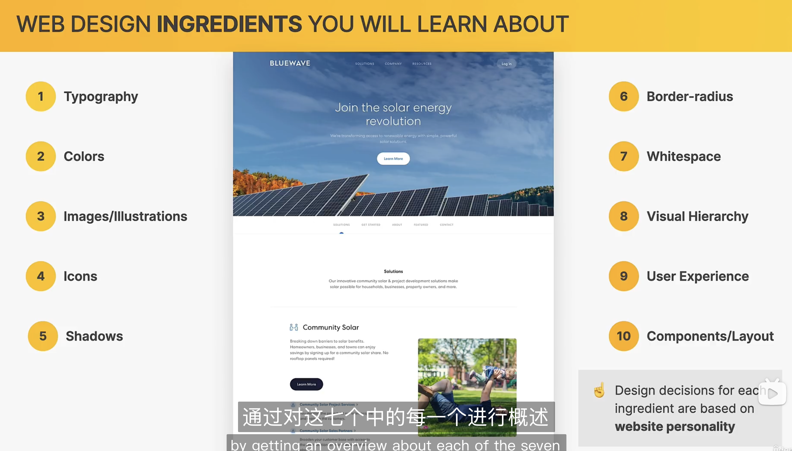


* 网站的个性：

​	1.严肃优雅的风格：奢侈与优雅，淡的，金色颜色，高质量的图片


​	2.极简风格：聚焦必要的内容，小或中的sans-serif黑字，少许图片和图标

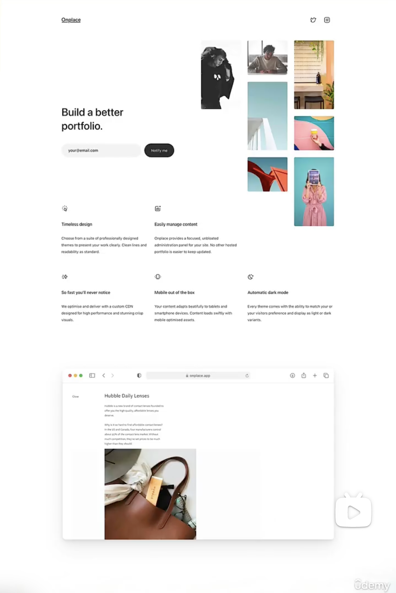


​	3.朴素，中性风格：设计避免干扰用户体验，使用中性和小的字体，非常结构化的布局，常见于大公司网站

​	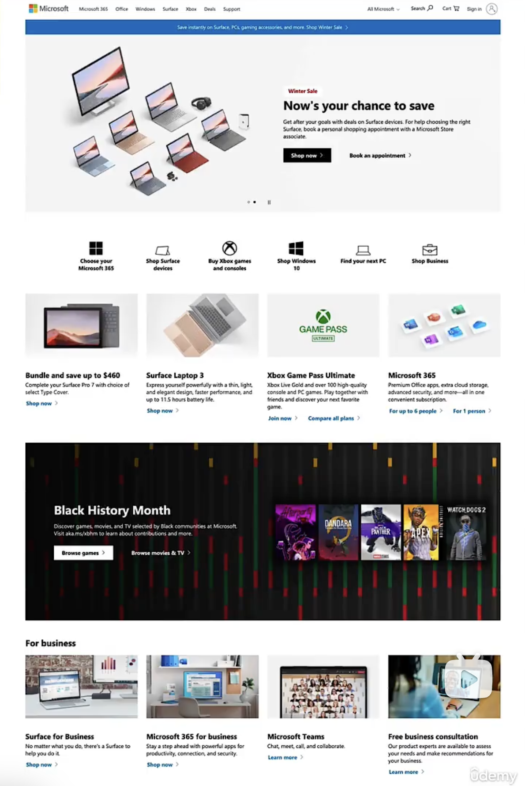

​	4.自信风格：通过特大图片和粗字体，留下印象，使用大和明亮的色块。

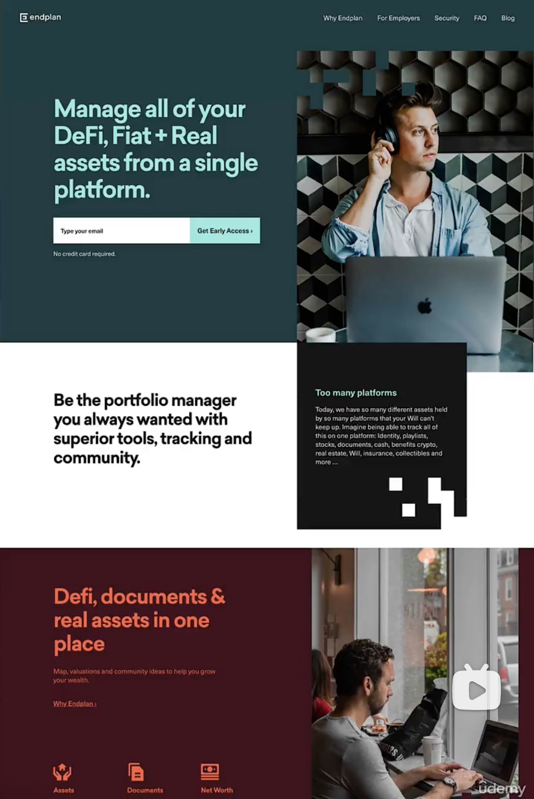

​	5.平和风格：产品和服务，温和的柔和的颜色，solt serif头部，匹配的图片

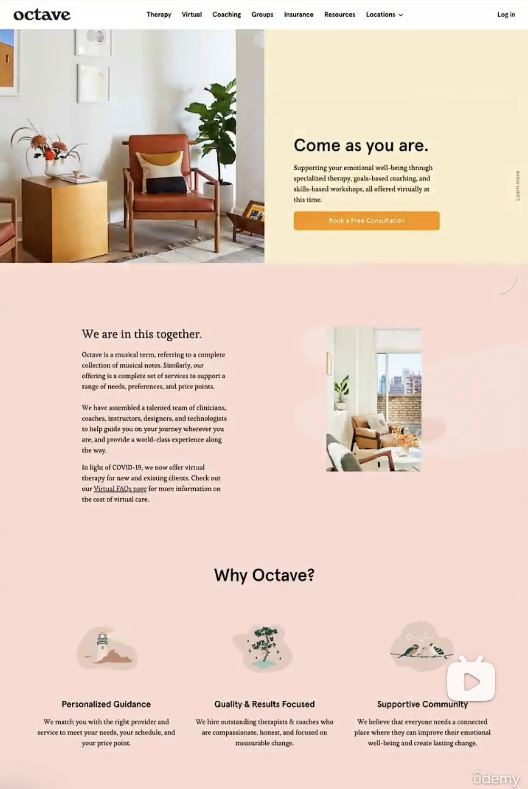

​	6.初创公司风格：中字sans-serif字体，亮灰色文字和背景，圆的组件

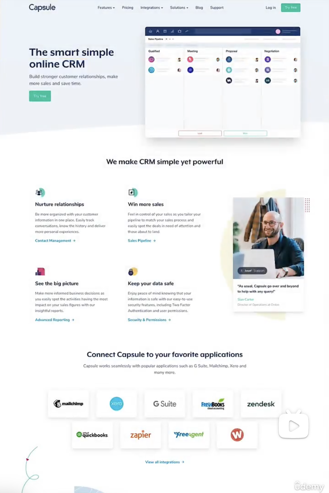

​	7.爱玩笑的风格：色彩丰富，圆的设计，创意的元素：手绘的图标，图片，动画，有趣的语言。

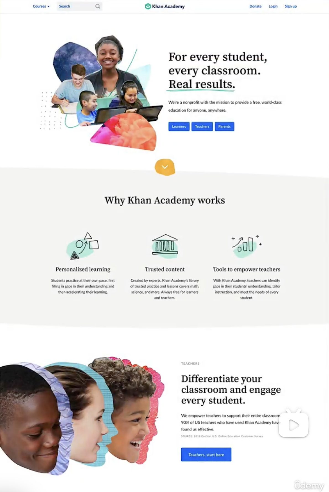

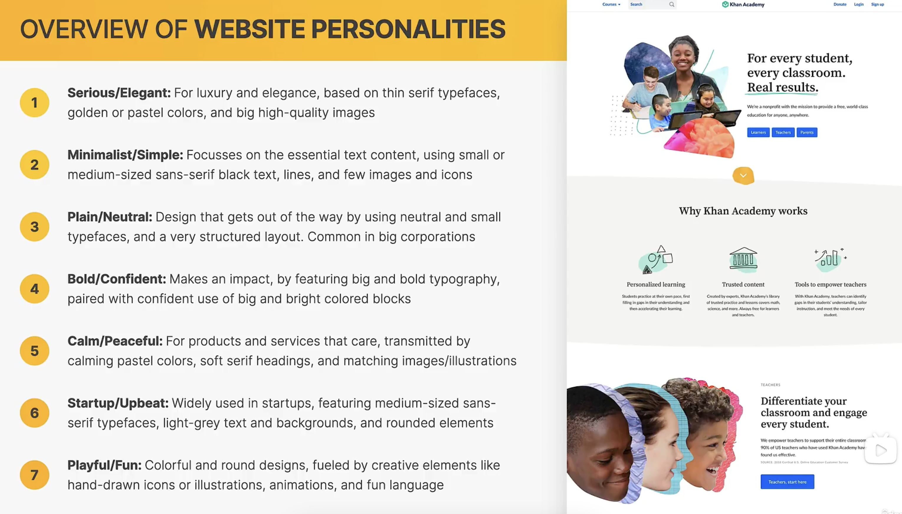


* 字体排版学

  * 是一种艺术和技术：安排文字，让它清晰，易于阅读，有吸引力。

  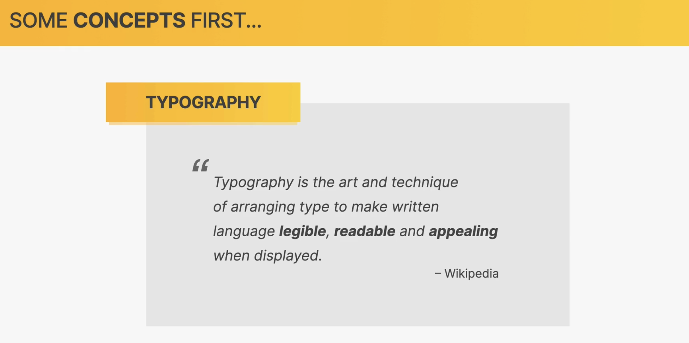


* 衬线字体和无衬线字体区别

  * 衬线字体
    * 在字母的开始结束有额外装饰，字体粗细有不同。
    * 比较传统和古典的感觉
    * 传达可信度
    * 擅长长文本

  * 无衬线字体
    * 现代的观感
    * 干净和简单
    * **对于初学者友好**

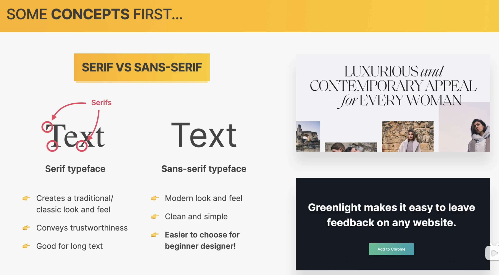


* 使用好的和流行的字体
* 工具箱：下载字体的网站：google fonts ：https://fonts.google.com/
* 工具箱：下载字体的网站：font squirrel：https://www.fontsquirrel.com/
* 这六种字体都是免费且流行的


* 一个页面只使用一种字体，最多限制在两种

* 根据你的网站个性选择字体：

  1.选择你网站的个性风格

  2.衬线字体和无衬线字体二选一

  3.实验老师提到的6种字体

  4.先选择一种字体进行设计，当页面文字完成后，再替换别的字体进行对比选择


* 使用好的字体大小和粗细

  4.限制字体大小的选择在一个一组字体大小，只选择这组字体大小内的大小。节省选择时间。

  ```
  /*
  SPACING SYSTEM (px)
  2 / 4 / 8 / 12 / 16 / 24 / 32 / 48 / 64 / 80 / 96 / 128
  
  FONT SIZE SYSTEM (px)
  10 / 12 / 14 / 16 / 18 / 20 / 24 / 30 / 36 / 44 / 52 / 62 / 74 / 86 / 98
  */
  ```
  
  5.使用字体大小在16px到32px之间
  
  6.对于长文本，使用大于20px的字体
  
  7.对于标题，可以使用50px+和600+bold，基于网站风格
  
  8.对于所有字体，不要使用字体粗细低于400（regular）


* 创造良好的阅读体验

  9. 每一行字数小于75

     

  10. 对于普通大小的文本，使用行高在1.5到2之间，对于大文本，可以到1.5以下：1.1-1.2

      ```
      line-height: 1.1;
      ```

      * 越小和越长的字，需要越大的行高。

        

  11. 在标题中，如果感觉不自然，减少文本的间距。

      ```
       letter-spacing: -1px;
      ```

  

  12. 实验让所有小标题都使用大写，让它们小而粗，还有增加字母的间距

  
  
  13. 不要对齐文本
  
  
  
  14. 不用居中长文本块，小块是可以的：
  
  


* 在实验中，选取Inter字体，的Regular：400,Medium：500,Bold：700，获得google生成的字体链接。

  

* 放在html文件的header中。

  ```html
  <head>
    <meta charset="UTF-8" />
    <meta http-equiv="X-UA-Compatible" content="IE=edge" />
    <meta name="viewport" content="width=device-width, initial-scale=1.0" />
    <!-- 放置前 -->
    <link rel="preconnect" href="https://fonts.googleapis.com" />
    <link rel="preconnect" href="https://fonts.gstatic.com" crossorigin />
    <link
      href="https://fonts.googleapis.com/css2?family=Inter:opsz,wght@14..32,100..900&display=swap"
      rel="stylesheet"
    />
     <!-- 放置后，后面是自己的css文件 -->
    <link rel="stylesheet" href="style.css" />
    <title>Lisbon Chair Shop</title>
  </head>
  ```


* 使用时：

  ```css
  body {
    /* 优先选择inter，如果没有网络时则选择第二选择：默认的字体 */
    font-family: "Inter", sans-serif;
  }
  ```


* Typescale:选择网站要使用的一组字体大小：
	https://typescale.com/


或者使用老师的字体系统：

```css
/*
SPACING SYSTEM (px)
2 / 4 / 8 / 12 / 16 / 24 / 32 / 48 / 64 / 80 / 96 / 128

FONT SIZE SYSTEM (px)
10 / 12 / 14 / 16 / 18 / 20 / 24 / 30 / 36 / 44 / 52 / 62 / 74 / 86 / 98
*/
```


* 技巧：查看完整页面属性


* 技巧：鼠标选中1.2，Alt+-小数以+-0.1调整行高


* 技巧：先选择网站字体，然后页面从上到下依次调整元素的大小，字母间距，上下间距。


* 字体排版例子：

```css
/* ------------------------ */
body {
  /* 优先选择inter，如果没有网络则选择默认的字体 */
  font-family: "Inter", sans-serif;
}

h2 {
  margin-bottom: 48px;
  /* 24 / 30 / 36 / */
  font-size: 36px;
  letter-spacing: -0.5px;
}


/* ------------------------ */
/* COMPONENT STYLES */
/* ------------------------ */

/* HEADER */
h1 {
  margin-bottom: 24px;
  /*标题字体大*/
  font-size: 42px;
  /*标题行高小*/
  line-height: 1.1;
  /*标题间距小*/
  letter-spacing: -1px;
}

.header-text {
  margin-bottom: 24px;
  /*正文字体正常*/
  font-size: 18px;
  /*正文行高正常*/
  line-height: 1.7;
}

/* FEATURES */

.features-title {
  margin-bottom: 16px;
  font-size: 20px;
}

.features-text {
  /*正文字体正常*/
  font-size: 18px;
  /*正文行高正常*/
  line-height: 1.7;
}

/* TESTIMONIAL */
.testimonial-box h2 {
  margin-bottom: 24px;
  /* 20 / 24 / 30 */
  font-size: 24px;
}

.testimonial-text {
  font-style: italic;
  margin-bottom: 24px;
  font-size: 18px;
  line-height: 1.7;
}

/* CHAIRS */

h3 {
  margin-bottom: 24px;
  font-style: 20px;
}

.chair-price {
  display: flex;
  justify-content: space-between;
  font-style: 20px;
}

footer {
  margin-bottom: 48px;
   /*footer字体要比正文更小*/
  /* 10 / 12 / 14 */
  font-style: 14px;
}
```


* 颜色

  1. 让网站主色与你的风格匹配，因为颜色传达意义：
     * 红色：让人最注意，象征力量，热情，兴奋
     * 橙色：不那么具有攻击性，传达出快乐、欢快和创造力。
     * 黄色：代表着喜悦、明亮和智慧。
     * 绿色：象征着和谐、自然、成长和健康。 
     * 蓝色：象征着和平、诚信和专业精神。 
     * 紫色：象征着财富、智慧和魔力。
     * 棕色：与自然、耐用性和舒适性紧密相关。 
     * 黑色：象征着力量、优雅和简约，但同时也代表着悲伤和痛苦。

     

  

​	2.使用合适的色彩色调，不要使用随机的调色或者css命名的颜色。

   * * 使用工具箱，生成颜色：open color，tailwindcss，flat ui colors


3. 你需要至少两种颜色，主色和灰色，灰色不一定是灰色，可以是深色。


4. 随着经验的增加，你可以添加更多的颜色：accent（secondary），使用工具来确定这种颜色。

   

5. 为了多样性，使用更亮（tints）和更暗（shades）的版本，使用工具生成它们：palleton.com, coolors, tint & shade generator

   

6. 主色是用来引起客户注意的，一般在最重要的元素上使用，如按钮。

   


7.使用有趣的accents点缀或者让整个组件或者段突出：


8. 在插图中也使用相应的主色：

   

9. 在深色的颜色背景上，使用背景的浅色（lighter）版本来书写文字：

   

10. 文字不能使用纯黑色，使用灰色：

    

11.不要让文字太亮，使用工具检查文字与背景之间的对比度：coolors

* * 正常文字对比度需要达到4.5:1，而大字（18px+）对比度需要达到3:1


* 挑选颜色：Open-color工具：https://yeun.github.io/open-color/

* 背景和文字的对比度检查工具：https://coolors.co/contrast-checker

  

* 颜色例子：

  ```css
  /*
  SPACING SYSTEM (px)
  2 / 4 / 8 / 12 / 16 / 24 / 32 / 48 / 64 / 80 / 96 / 128
  
  FONT SIZE SYSTEM (px)
  10 / 12 / 14 / 16 / 18 / 20 / 24 / 30 / 36 / 44 / 52 / 62 / 74 / 86 / 98
  */
  
  /*
    根据网站风格，去Open-color挑选主色和灰色
    MAIN COLOR:#087f5b 主色
    GRAY COLOR:#343a40 灰色
  */
  * {
    margin: 0;
    padding: 0;
    box-sizing: border-box;
  }
  
  /* ------------------------ */
  /* GENERAL STYLES */
  /* ------------------------ */
  body {
    /* 优先选择inter，如果没有网络则选择默认的字体 */
    font-family: "Inter", sans-serif;
    /* 所有字体颜色：灰色 */
    color: #343a40;
    /* 网站底部颜色：主色 */
    border-bottom: 8px solid #087f5b;
  }
  
  /* 最需要突出的是按钮：使用主色*/
  .btn:link,
  .btn:visited {
    /* 按钮背景使用主色 */
    background-color: #087f5b;
    /* 按钮字使用白色：去coolor.co检查字体颜色和背景颜色的对比度 */
    color: #fff;
    text-decoration: none;
    text-transform: uppercase;
    font-weight: 500;
    display: inline-block;
  }
  
  .btn:hover,
  .btn:active {
    /* 按钮选中时使用主色的亮色版本：从Open-color获取 */
    background-color: #099268;
  }
  
  .btn--big {
    font-size: 18px;
    padding: 16px 32px;
  }
  
  .btn--small {
    font-size: 14px;
    padding: 8px 12px;
  }
  /* ------------------------ */
  /* COMPONENT STYLES */
  /* ------------------------ */
  
  /* HEADER */
  
  /* FEATURES */
  
  /* TESTIMONIAL */
  /*关键部分背景使用主色突出强调*/
  .testimonial-section {
    /*关键部分背景使用主色突出强调*/
    background-color: #087f5b;
    color: #fff;
    padding: 24px;
  }
  
  /* CHAIRS */
  footer {
    margin-bottom: 48px;
    /* 10 / 12 / 14 */
    font-style: 14px;
    /*footer拥有更亮的灰色：去coolor.co检查字体颜色和背景颜色的对比度*/
    color: #495057;
  }
  ```

  
