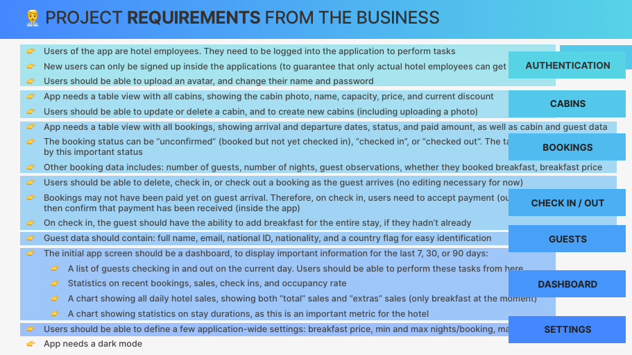
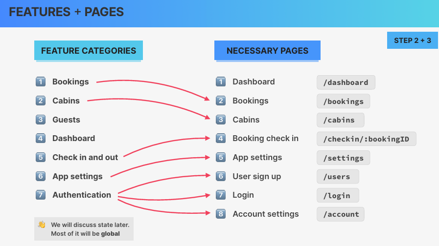
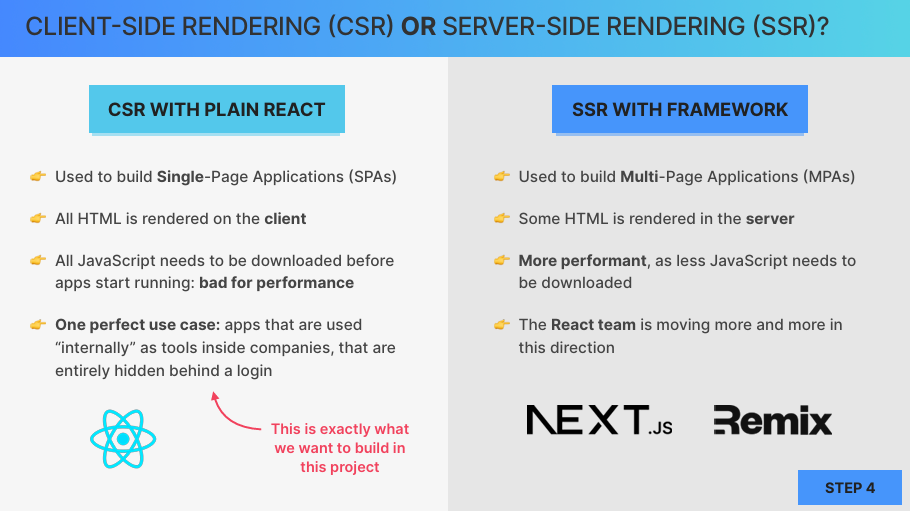
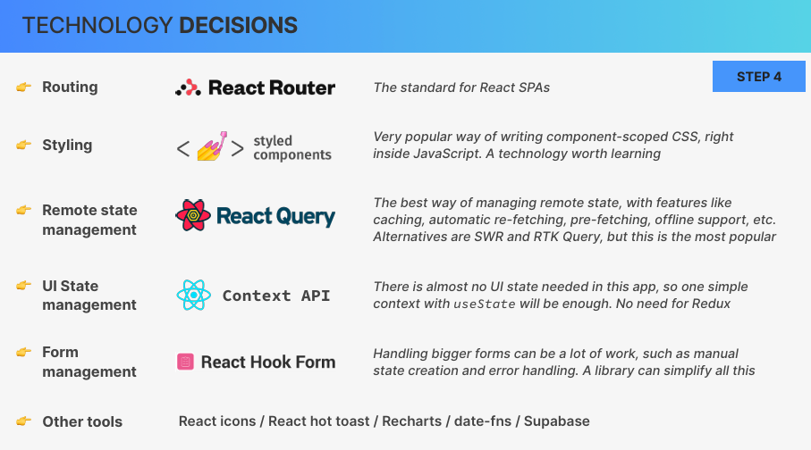
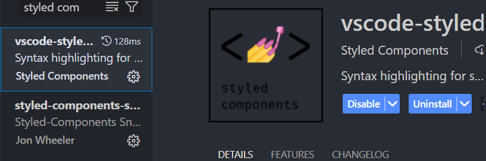

* 使用useFetcher直接获取后端api数据：

```jsx
import { useFetcher, useLoaderData } from 'react-router-dom';
const fetcher = useFetcher();

useEffect(
function () {
  if (!fetcher.data && fetcher.state === 'idle') fetcher.load('/menu');
},
[fetcher],
);
```


* fetcher.Form的使用：执行action回调：

```jsx
import { action as updateOrderAction } from './features/order/UpdateOrder';  
 {
    path: '/order/:orderId',
    element: <Order />,
    loader: orderLoader,
    errorElement: <Error />,
    action: updateOrderAction,//
  },
```

```jsx
import Button from '../../ui/Button';
import { useFetcher } from 'react-router-dom';
import { updateOrder } from '../../services/apiRestaurant';
function UpdateOrder({ order }) {
  const fetcher = useFetcher();

  return (
    <fetcher.Form method="PATCH" className="text-right">
      <Button type="primary">Make priority</Button>;
    </fetcher.Form>
  );
}

export default UpdateOrder;

export async function action({ request, params }) {
  const data = { priority: true };
  await updateOrder(params.orderId, data);
  return null;
}
```


* 根据需求划分特性



* 根据特性划分页面



* 内部的管理系统不存在搜索引擎优化问题，适合客户端渲染。



* 技术选型



* 安装styled-compoents库

```
npm i styled-components
```


* 安装styled-components插件，显示代码颜色正常

