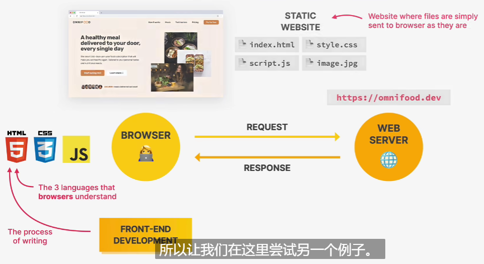
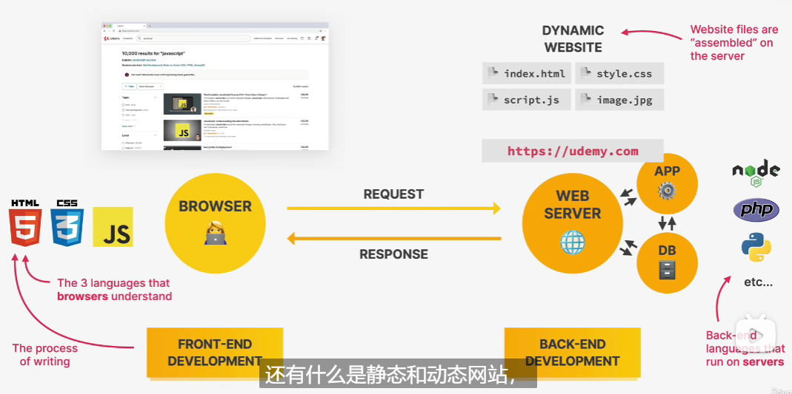
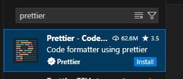
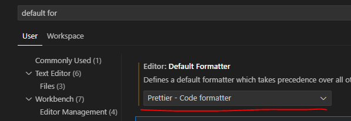
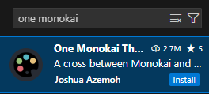
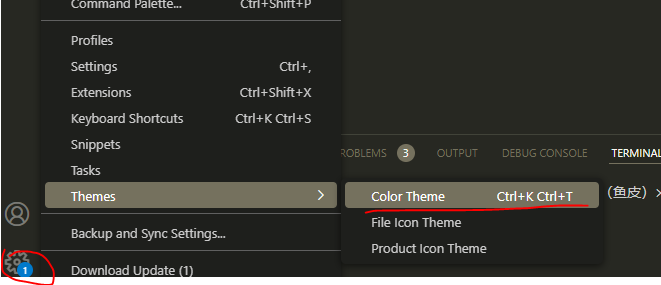
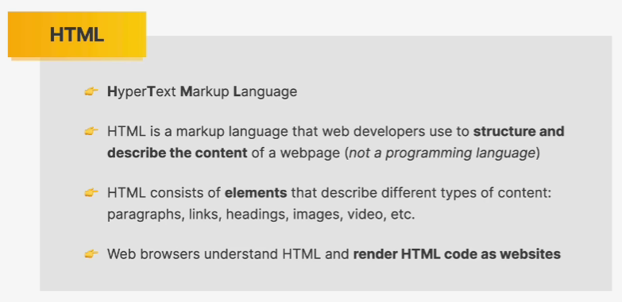
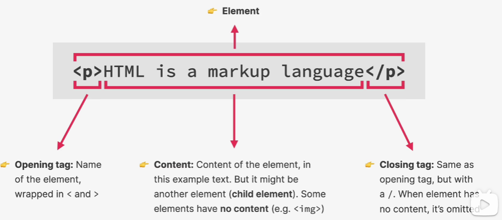

##### 第一课：课程

* 课程内容

1. web design

2. html

3. css

4. responsive design

   

* 静态网页：static website：只有前端，没有后端。



* 动态网站：Dynamic website：有后端支持，页面内容由后端动态生成。



* HTML像名词
* CSS像形容词
* JS像动词


##### 第二课：安装VSCODE

* 安装prettier插件：



插件作用：每当你保存的时候，会自动格式化你的代码。

* 进入setting，设置默认formatter为prettier：



* 设置formart on save属性：保存时自动格式化：


* 自动保存：离开窗口时自动保存文件：


* tab size设置为2：


* 安装颜色主题插件：

  

* 设置主题：




##### 第三课：写第一个网页

使用！+回车：生成模板

```html
<!DOCTYPE html>
<html lang="en">
  <head>
    <meta charset="UTF-8" />
    <meta name="viewport" content="width=device-width, initial-scale=1.0" />
    <title>My first webpage</title>
  </head>
  <body>
    <h1>Hello, world!</h1>
    <p>My name is Jojo, and this is my very first webpage :D</p>
  </body>
</html>
```


##### 第四课：HTML




* 标签



* 基本结构

  * 声明

  * html标签

  * head标签

  * body标签

  ```html
  <!DOCTYPE html>
  <html>
    <head>
      <title>The Basic Language of the web: HTML</title>
    </head>
  
    <body>
      <h1>The Basic Language of the web: HTML</h1>
    </body>
  </html>
  
  ```

  

* p标签

  p标签代表段落，一个段落的话放进p标签里。

  

* h1标签

  最佳实践：一个网页里最好只有一个h1标签。

  

* b加粗

  ```html
   <b>Laura Jones</b>
  ```

  最佳实践：别用b，用strong代替，b没有什么含义。

  ```html
  <strong>Laura Jones</strong>
  ```

  

* i斜体

  ```html
  <i>fundamental</i>
  ```

  最佳实践：别用i，用em代替，i没有什么含义。

  ```html
  <em>fundamental</em>
  ```

  
