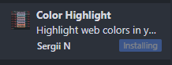
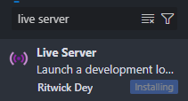
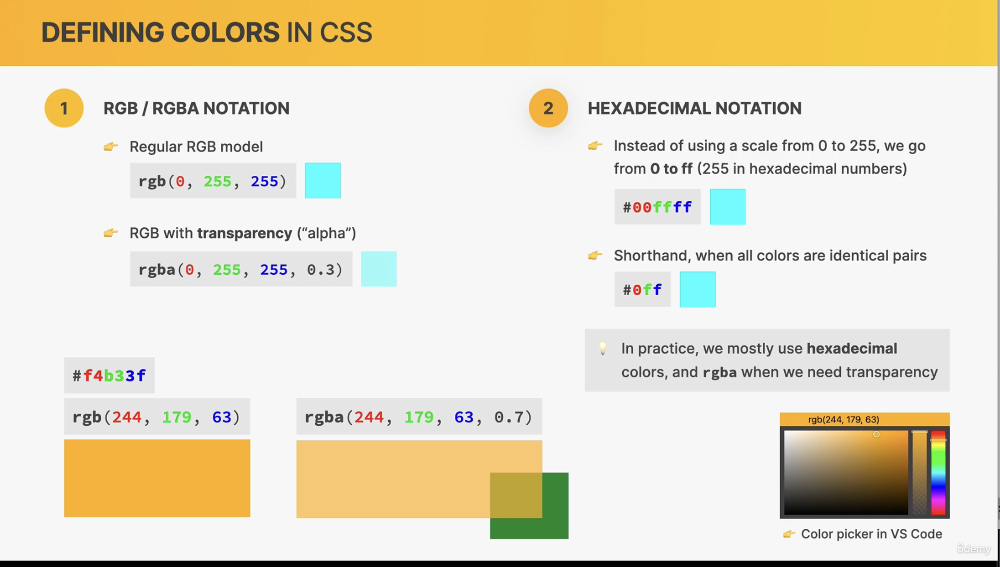

##### 第一课：课程

* 课程内容

1. web design

2. html

3. css

4. responsive design

   

* 静态网页：static website：只有前端，没有后端。


* 动态网站：Dynamic website：有后端支持，页面内容由后端动态生成。


* HTML像名词
* CSS像形容词
* JS像动词


##### 第二课：安装VSCODE

* 安装prettier插件：


插件作用：每当你保存的时候，会自动格式化你的代码。

* 进入setting，设置默认formatter为prettier：


* 设置formart on save属性：保存时自动格式化：


* 自动保存：离开窗口时自动保存文件：


* tab size设置为2：


* 安装颜色主题插件：

  

* 设置主题：


* 安装Image preview：html图片预览


* 安装color highlight：高亮CSS颜色，可视化

  


* 安装Auto Rename Tag:同时修改<xx>和</xx>


* 安装live server：本地启动网页，支持html修改后，自动更新网页



* alt+B 在浏览器中打开网页

  

##### 第三课：写第一个网页

使用！+回车：生成模板

```html
<!DOCTYPE html>
<html lang="en">
  <head>
    <meta charset="UTF-8" />
    <meta name="viewport" content="width=device-width, initial-scale=1.0" />
    <title>My first webpage</title>
  </head>
  <body>
    <h1>Hello, world!</h1>
    <p>My name is Jojo, and this is my very first webpage :D</p>
  </body>
</html>
```


##### 第四课：HTML元素


* 标签


* 基本结构

  * 声明

  * html标签

  * head标签

  * body标签

  ```html
  <!DOCTYPE html>
  <html>
    <head>
      <title>The Basic Language of the web: HTML</title>
    </head>
  
    <body>
      <h1>The Basic Language of the web: HTML</h1>
    </body>
  </html>
  
  ```

  

* p标签

  p标签代表段落，一个段落的话放进p标签里。

  

* h1标签

  最佳实践：一个网页里最好只有一个h1标签。

  

* b加粗

  ```html
   <b>Laura Jones</b>
  ```

  最佳实践：别用b，用strong代替，b没有什么含义。

  ```html
  <strong>Laura Jones</strong>
  ```

  

* i斜体

  ```html
  <i>fundamental</i>
  ```

  最佳实践：别用i，用em代替，i没有什么含义。

  ```html
  <em>fundamental</em>
  ```

  

* ol-li有序列表

  ``` html
  <ol>
  	<li></li>
  </ol>
  ```


* ul-li无序列表

  ```html
  <ul>
  	<li></li>
  </ul>
  ```


* img图片

  ```html
  
  ```
  
  最佳实践：必须写alt，方便搜索引擎确认图片内容。方便盲人使用网站。


* html标签加入语言

  ```html
  <html lang="en">
  ```


* head里加入meta指定字符集

  ```html
  <head>
  	<meta charset="UTF-8"/>
  	<title>title</title>
  </head>
  ```


* a：链接有两种，又称为锚点

  1.站内的网页

  2.站外网页

  ```html
  <a href="https://developer.mozilla.org/zh-CN/docs/Web" target="_blank"
    >MDN Web Docs </a
  ```

  _blank决定是否会打开新的页面跳转。

  ```html
  <a href="#">test</a>
  ```

  #是一个占位符，该链接不指向任何。

  

* 面向开发者的web网站：

  [面向开发者的 Web 技术 | MDN](https://developer.mozilla.org/zh-CN/docs/Web)


* 导航栏盒子nav

  标识网站导航栏的盒子：

  ```html
  <nav>
  	<a href="blog.html">Blog</a>
  	<a href="#">Challengs</a>
  	<a href="#">Flexbox</a>
  	<a href="#">CSS Grid</a>
  </nav>
  ```

  

* 网站头部header

  标识网站的头部或者正文的头部的盒子

  ```html
  <header>
    <h1>📘 The Code Magazine</h1>
    <nav>
      <a href="blog.html">Blog</a>
      <a href="#">Challengs</a>
      <a href="#">Flexbox</a>
      <a href="#">CSS Grid</a>
    </nav>
  </header>
  ```


* 网站正文article

  标识网站的正文的盒子

  ```html
  <article>
  <h2>Basic Language of the Web: HTML</h2>
      
      ...
  </article>
  ```

  

* 网站的末尾footer

  标识网站的末尾的盒子

  ```html
  <footer>Copyright &copy; 2027 by The Code Magazine.</footer>	
  ```


* 网站的附属信息aside

  标识网站的次要内容

  ```html
  <aside></aside>
  ```

  

* 语义semantic HTML

  nav，header，footer，p本质都是div，只是为了表达语义而存在的。

  事实上，可以用div来替代所有其他的元素，配合CSS实现同样的效果。

  使用语义HTML的优点：

  * 搜索引擎优化
  
  * 方便使用文字阅读器的人
  
    

* 不错的网站：HTML特殊符号代码

[Glyphs | CSS-Tricks](https://css-tricks.com/snippets/html/glyphs/)


##### 第五课：CSS

* CSS描述了视觉风格。

  

* CSS规则


CSS有三种使用方法：

* 内联CSS：inline CSS

  ```html
  <h1 style="color: blue">📘 The Code Magazine</h1>
  ```

  不要使用这种CSS。


* 内部CSS：internal CSS

  ```html
  <html lang="en">
    <head>
      <meta charset="UTF-8" />
      <title>The Basic Language of the web: HTML</title>
      <style>
        h1 {
          color: blue;
        }
      </style>
    </head>
     ...
  ```

  放在head里的CSS


* 外部CSS：external CSS

  ```html
  <head>
      <meta charset="UTF-8" />
      <link href="style.css" rel="stylesheet" />
      <title>The Basic Language of the web: HTML</title>
  </head>
  ```

  在head里放css文件的链接


* 字体

  ```css
  h1 {
    color: blue;
    font-size: 26px;
    font-family: sans-serif;/* 字体 */
    text-transform: uppercase;/* 全大写 */
    font-style: italic;/* 斜体 */
    text-align: center;/* 在父元素内居中 */
    font-weight: bold;/* 加粗 */
  }
  ```

  

* 行高

  ```css
  p {
    font-size: 22px;
    font-family: sans-serif;
    line-height: 1.5; /* 行高1.5倍字体大小 */
  }
  ```

  

* 多元素集中设置:List selector

  ```css
  h1,
  h2,
  h3,
  h4,
  p,
  li {
    font-family: sans-serif;
  }
  ```

  

* 后代选择器：选择父元素为footer的p

  ```css
  footer p {
    font-size: 10px;
  }
  ```


* id选择器

  id是独一无二的，只允许一个元素拥有。尽量不使用id。

  HTML:

  ```html
  <p id="author">
    Posted by <strong>Laura Jones</strong> on Monday, June 21st 2027
  </p>
  ```

  CSS:

  ```css
  #author {
    font-size: 5px;
  }
  ```


* class选择器

  class可以有多个元素同时拥有。尽量使用class。

  ```css
  ul{
  	list-style:none;
  }
  ```

  ```html
  <ul class="related">
  </ul>
  ```

  

* 取消ul的黑点

  ```css
  ul{
  	list-style:none;
  }
  ```

  ```html
  <ul class="related">
  </ul>
  ```

  

* RGB模型

  


* rgb(0,0,0)
* rgba(0,0,0,0.3):0.3是透明度
* 十六进制：#00ffff，可以简写为#0ff
* 最佳实践：平时
* 使用十六进制，当需要透明度时，使用rgba




* 灰色：RGB三个值一样的颜色都是灰色


* border边框

  ```css
  
  aside {
    background-color: #f7f7f7;
    border-top: 5px solid #1098ad; /* 上边框 */
    border-bottom: 5px solid #1098ad; /* 下边框 */
    border: 5px solid #1098ad; /* 上下左右 四个方向边框 */
  }
  ```

  solid是连线，可以改成虚线dashed等别的样式
